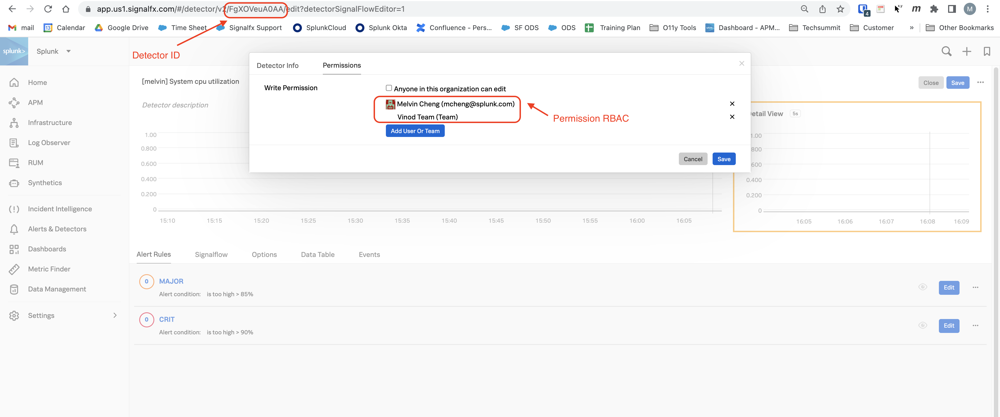
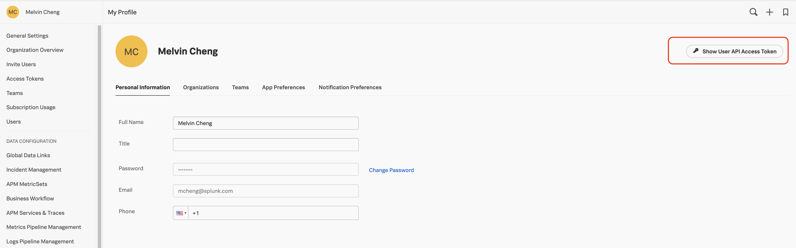
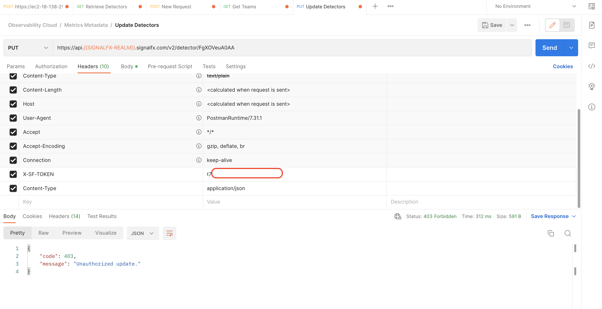
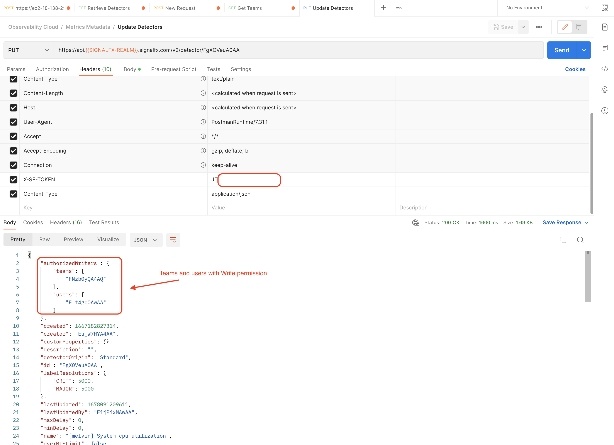
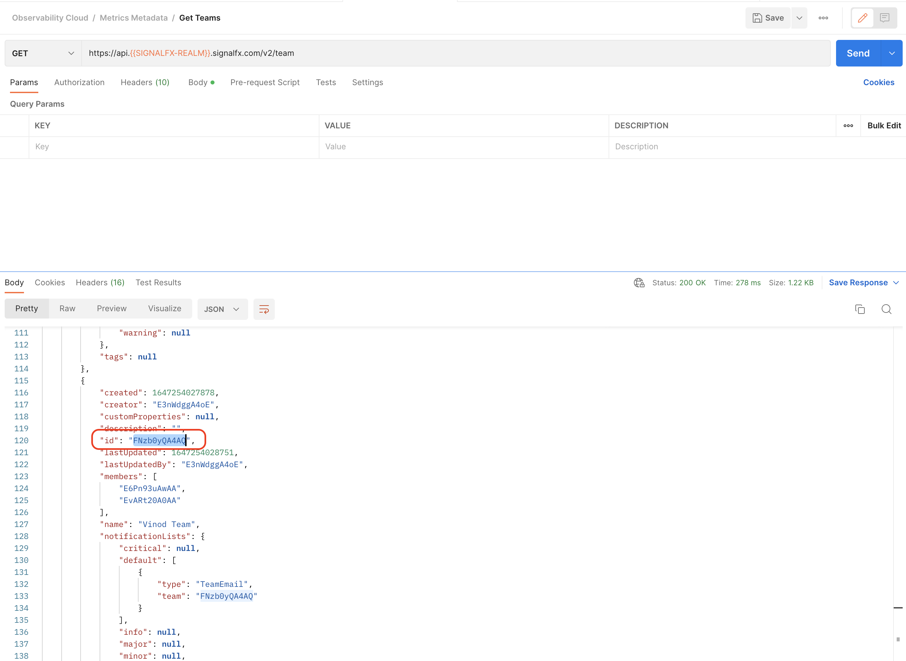
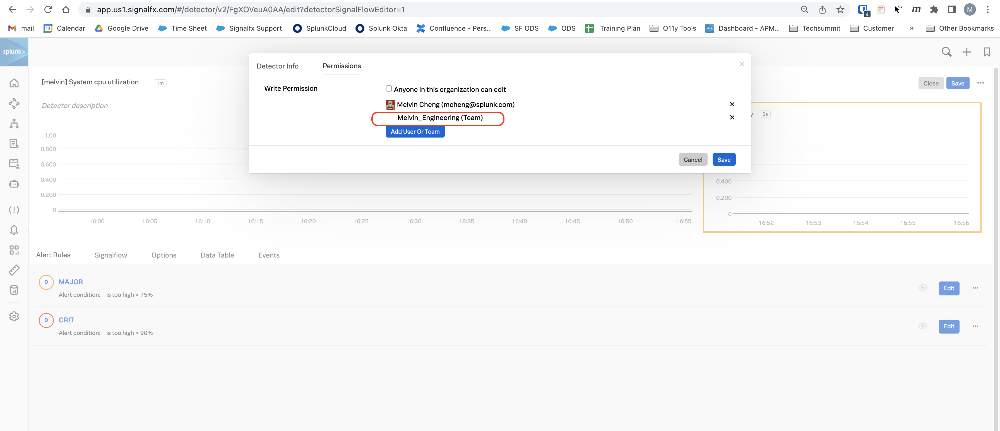

# Splunk-API

The document highlights
- test result of RBAC setting for O11y Detectors
- the steps required to update the permission across the O11y `Detectors`.

 

## Test Result for O11y Dectectors RBAC   
 

### Step 1 - Configured RBAC Permission for Detectors
---

Setup the RBAC for the O11y detectors.   

Note that only the `owner` or `member of the team` are authorized to perform `write` operation.

.

### Step 2 - Retrieve the user API key

User API key is required to authenticate via the [Splunk Observability API](https://dev.splunk.com/observability/reference).

### Step 3 - Update 1 **(Fail)**

Attempting to update the Detector with the API key of a user that is **not** the `owner` or `member of the team` via the API.

### Step 4 - Update 2 **(Pass)**

Attempting to update the Detector with the API key of a user that is the `owner` or `member of the team` via the API.

---

## To automate the Permission across O11y Detectors

### <a name="step1"> Step 1 </a> - Retrieve the team ID for the organisation

Login via the Splunk Observability API and retrieve all the team ID.

### Step 2 - Update the teams with the correct Team ID from [step 1](#step1)

Update the values inside the `authorizedWriters.teams` field with the extractor team ID from the previous step and perform a `PUT` operation to submit the payload. 

